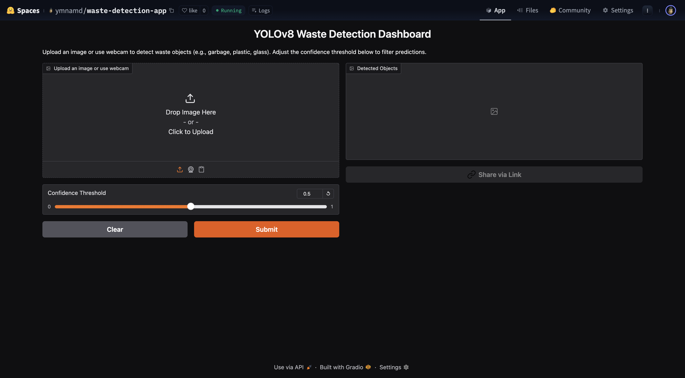
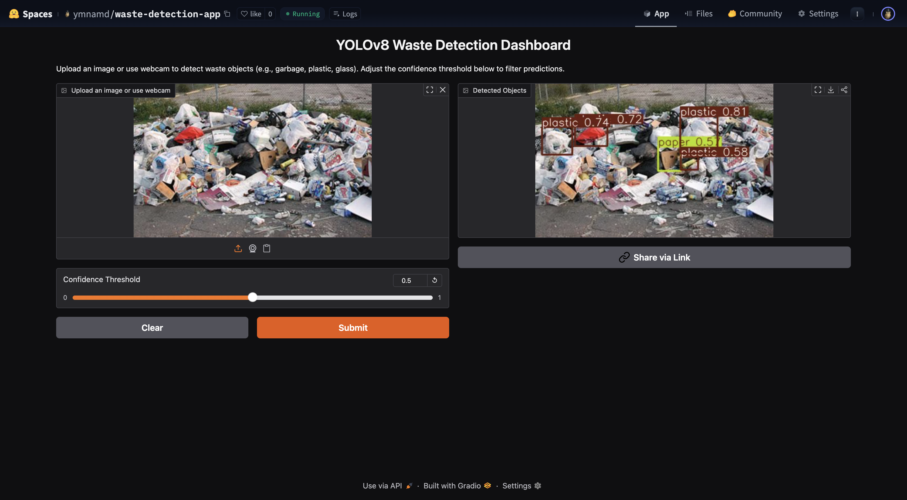

# 🧠 YOLOv8 Waste Detection Dashboard

A real-time object detection gradio app that identifies and labels different types of waste (e.g., plastic, metal, glass) using YOLOv8.

---

## 📊 Dataset Used
- Source: [fresh-waste-object-detection](https://universe.roboflow.com/workspace-4fppt/fresh-waste-object-detection/dataset/3)
- Classes: `plastic`, `metal`, `glass`, `paper`, `organic`
- Train/Val/Test Split: 1300 / 357 / 178 images

---

## 🛠️ Tools & Frameworks
- YOLOv8 (`ultralytics`)
- Python, Gradio
- Google Colab (for training)
- Hugging Face Spaces (for deployment)

---

## 🚀 Live App
👉 [Launch the app on Hugging Face](https://huggingface.co/spaces/ymnamd/waste-detection-app)

---

## 📈 Model Performance
| Metric         | Value     |
|----------------|-----------|
| mAP@0.5        | 0.515     |
| mAP@0.5:0.95   | 0.289     |
| Precision      | 0.545     |
| Recall         | 0.513     |

- Evaluated using test split
- Confusion matrix and PR curves included in `/val`

---

## 📸 Screenshots

### 🖼️ Dashboard


### 🧪 Detection Example


---

## 🎥 Video Walkthrough
[Watch Demo on Google Drive](https://drive.google.com/file/d/1DyzLLwsEoesYDc3ZMQQ-KJdPsIuOxD5j/view?usp=sharing)

---

## 📁 Project Structure

```bash
├── app.py                              # Gradio app
├── best.pt                             # YOLOv8 trained model
├── requirements.txt                    # Python dependencies
├── README.md                           # This file
├── assets/                             # Screenshots for README
├── data.yaml                           # Dataset config used for training
├── val/                                # YOLOv8 validation results (mAP, confusion matrix, etc.)
└── waste_detection_yolov8m.ipynb       # Colab notebook for model training